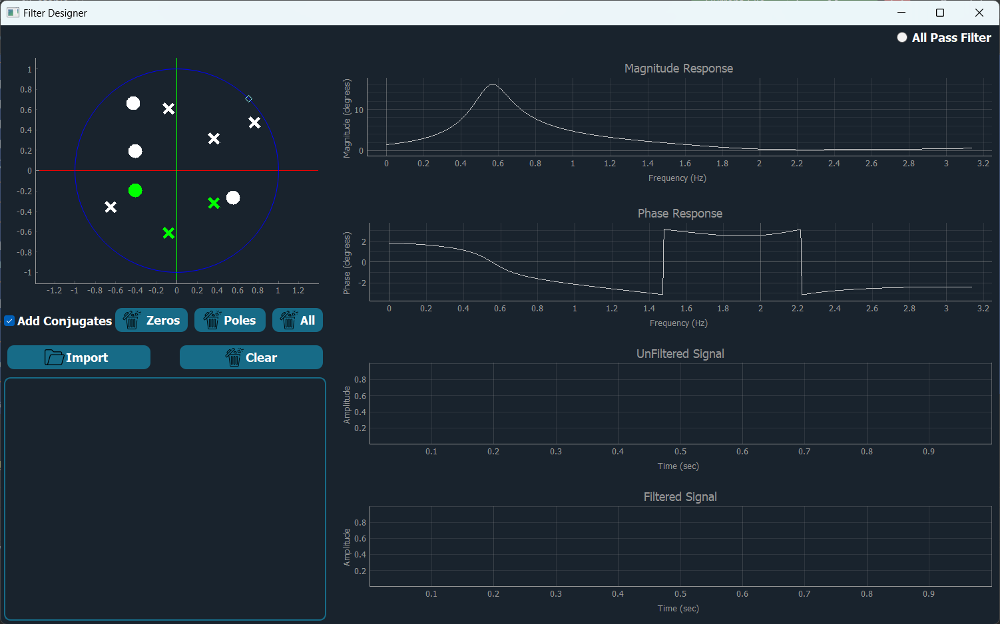
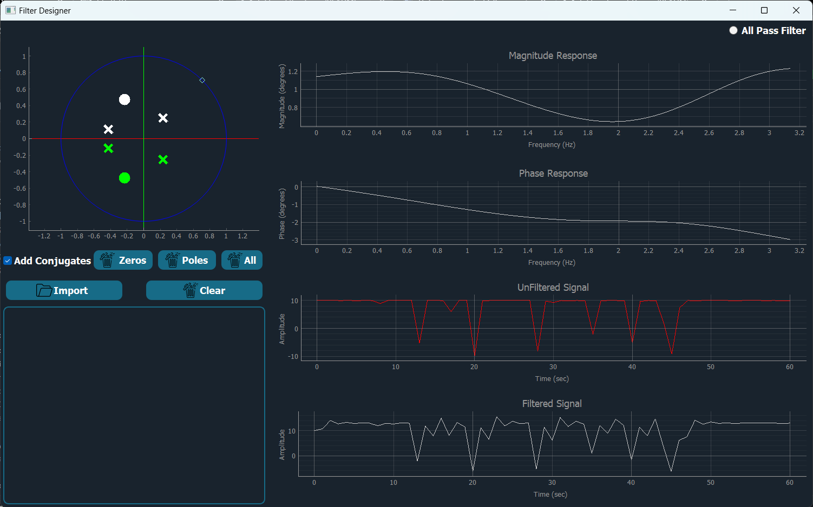
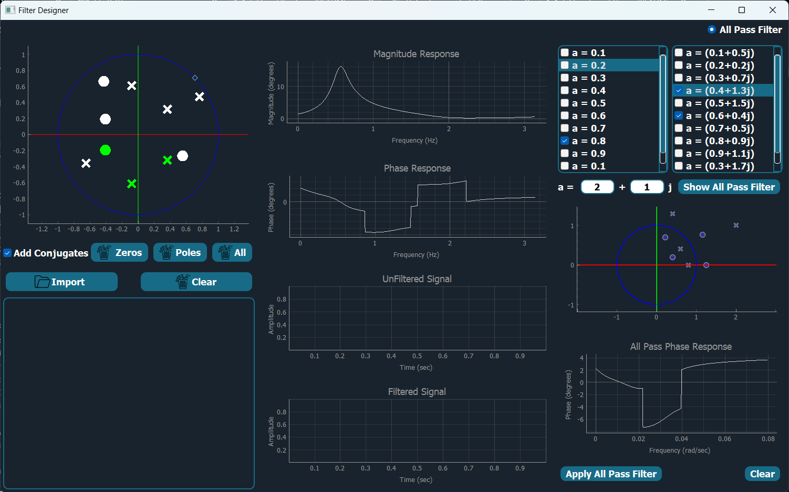

# Realtime Digital Filter Design

## Description

This project involves implementing a desktop application to help users design custom digital filters through the placement of zeros and poles on the z-plane. The application visualizes the filter's frequency response and allows for real-time filtering of signals.
<div style="text-align: center;">
    
</div>

## Table of Contents
1. [Features](#features)
2. [Installation](#installation)
3. [Usage](#usage)
4. [Dependencies](#dependencies)
5. [Contributors](#contributors)

   
 ## Features

### Z-Plane Plot
- **Unit Circle Display**: The plot includes a unit circle where users can place zeros and poles.
- **Interactive Modifications**:
    - Drag and Drop: Modify placed zeros/poles by dragging them.
    - Deletion: Click on a zero or pole to delete it.
    - Clear Options: Clear all zeros, all poles, or both.
    - Conjugate Addition: Option to add conjugates for complex elements.
     
      
### Frequency Response Plot
- Magnitude and Phase Response: Separate plots for magnitude and phase response corresponding to the placed zeros and poles.
  
 

### Real-time Signal Filtering
- **Signal Application**: Apply the designed filter on a lengthy signal (minimum 10,000 points).
    - Time Progress Visualization: Graphs showing the time progress of the signal and the filtered signal.
    - Speed Control: Slider to control the speed/temporal resolution of the filtering process.
- **Real-time Signal Input**: Input an arbitrary real-time signal via mouse movements.
    - Frequency Variation: Faster mouse movements generate higher frequencies, slower movements generate lower frequencies.
  
   

### Phase Correction with All-Pass Filters
- **All-Pass Filter Library**: Visualize and select from a library of all-pass filters.
- **Custom All-Pass Filter**: Build a custom all-pass filter by providing an arbitrary value.
- **Enable/Disable All-Pass Filters**: Enable or disable added all-pass elements via a drop-menu or checkboxes group.




## Installation
To install the project, clone the repository and install the requirements:

```bash
# Clone the repository
git clone https://github.com/omarshaban02/filter-forge.git
```
```bash
# Navigate to the project directory
cd filter-forge
```
```bash
# Install the required packages:
pip install -r requirements.txt
```
```bash
# Run the application:
python index.py
```

## Usage
1. **Open the Application**: Run main.py to start the application.
 
2. **Design Filte**:
- Use the z-plane plot to place zeros and poles.
- Modify or delete placed elements as needed.

3. **Visualize Response**: View the magnitude and phase response plots.
   
4. **Apply Filter**:
- Apply the designed filter on a lengthy signal and observe the real-time filtering process.
- Input a real-time signal via mouse movements.

5. **Phase Correction**:
- Select or build all-pass filters for phase correction.
- Enable or disable all-pass filters as needed.
     

## Dependencies
This project requires the following Python packages listed in the `requirements.txt` file:
- PyQt5
- opencv
- numpy
- pandas

## Contributors <a name = "contributors"></a>
<table>
  <tr>
    <td align="center">
    <a href="https://github.com/AbdulrahmanGhitani" target="_black">
    
    <br />
    <sub><b>Abdulrahman Shawky</b></sub></a>
    </td>
<td align="center">
    <a href="https://github.com/omarnasser0" target="_black">
    
    <br />
    <sub><b>Omar Abdulnasser</b></sub></a>
    </td>
         <td align="center">
    <a href="https://github.com/AhmedKamalMohammedElSayed" target="_black">
    
    <br />
    <sub><b>Ahmed Kamal</b></sub></a>
    </td>
         <td align="center">
    <a href="https://github.com/AbdullahOmran" target="_black">
    
    <br />
    <sub><b>Abdullah Omran</b></sub></a>
    </td>
      </tr>
 </table>


<!--
 <h2>Features</h2>
The user can browse their PC to open any signal file. Each signal type should have examples of both normal and abnormal signals.
The application contains two main identical graphs. Each graph can display different signals, and the user can control each graph independently or link them together.
When a signal file is opened, it is displayed in cine mode, simulating a running signal over time.
The user can manipulate the running signals through various UI elements, including changing color, adding labels/titles, showing/hiding signals, controlling cine speed, zooming in/out, pausing/playing/rewinding signals, and scrolling/panning the signal in any direction.
Signals can be moved between graphs.
The application takes care of boundary conditions to ensure signals are displayed within appropriate ranges.
The user can generate reports of snapshots from the graphs, including data statistics such as mean, standard deviation, duration, minimum, and maximum values for each signal. The report is generated in PDF format directly from the code. -->
